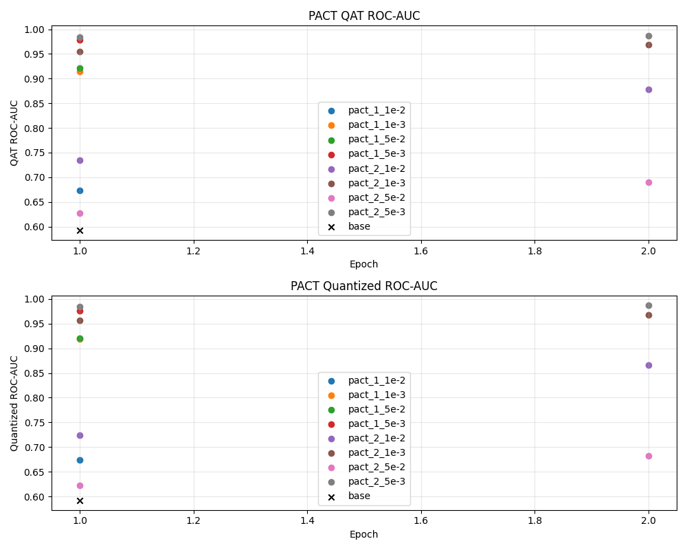
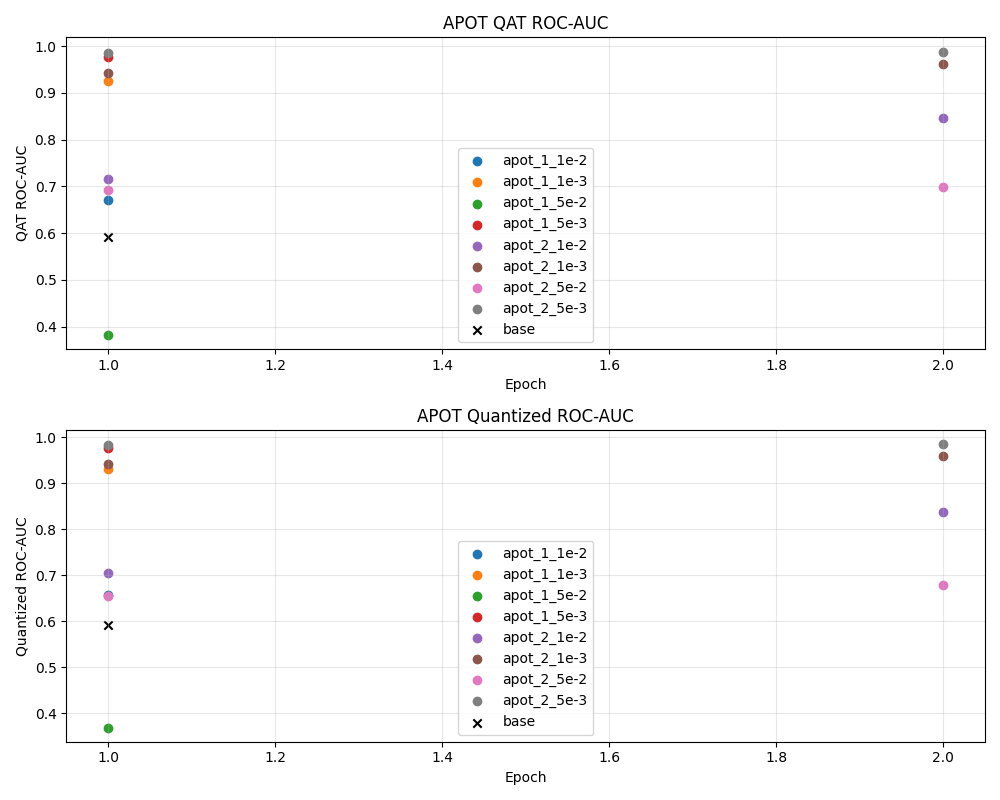
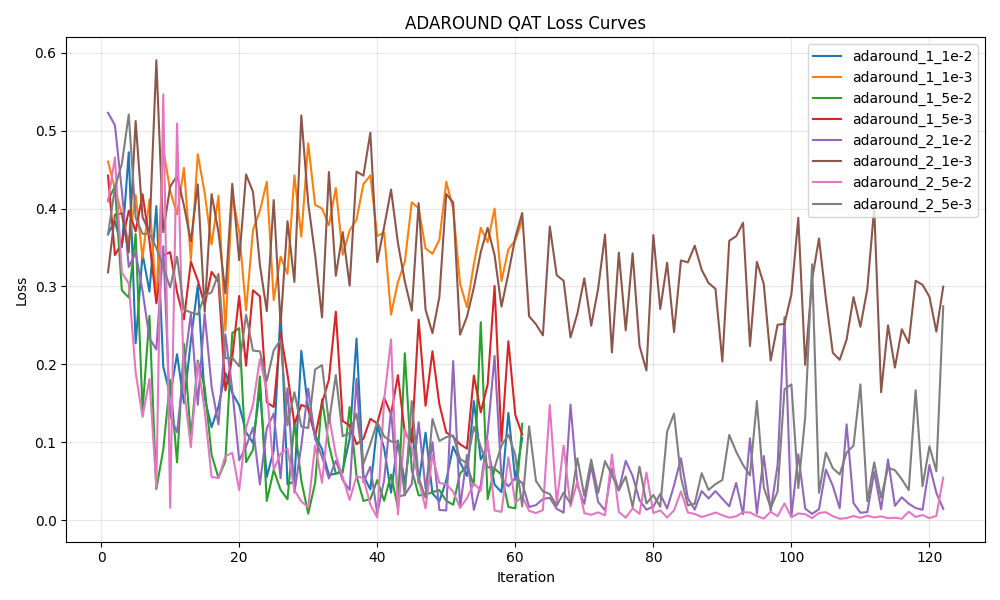
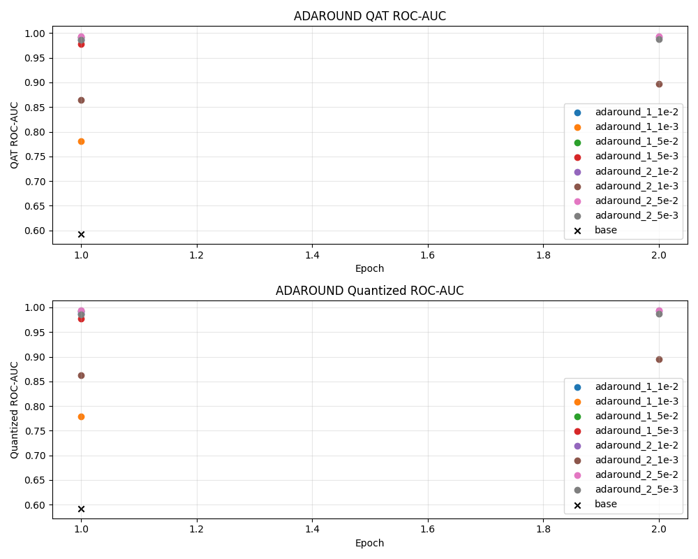
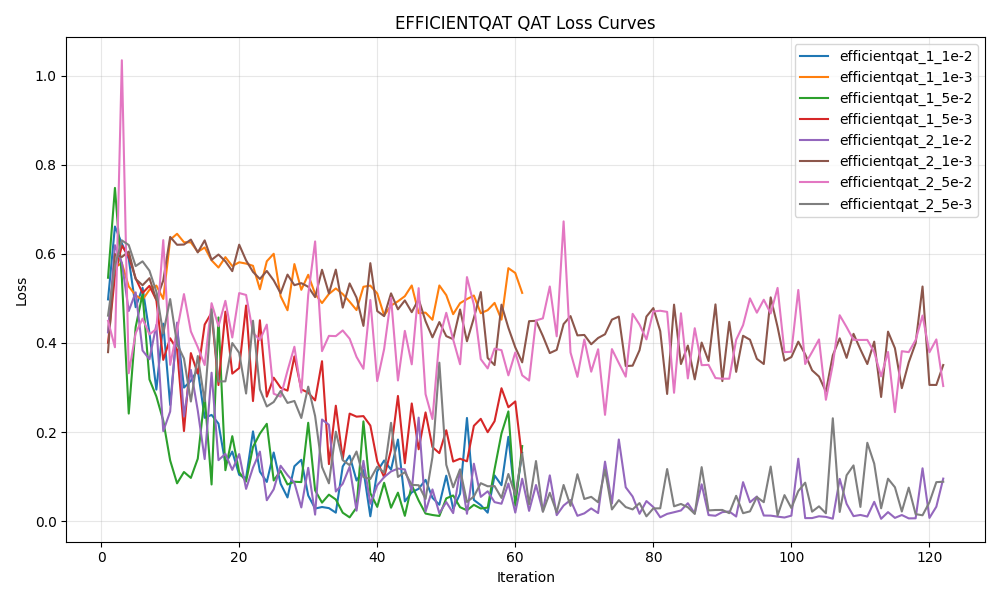
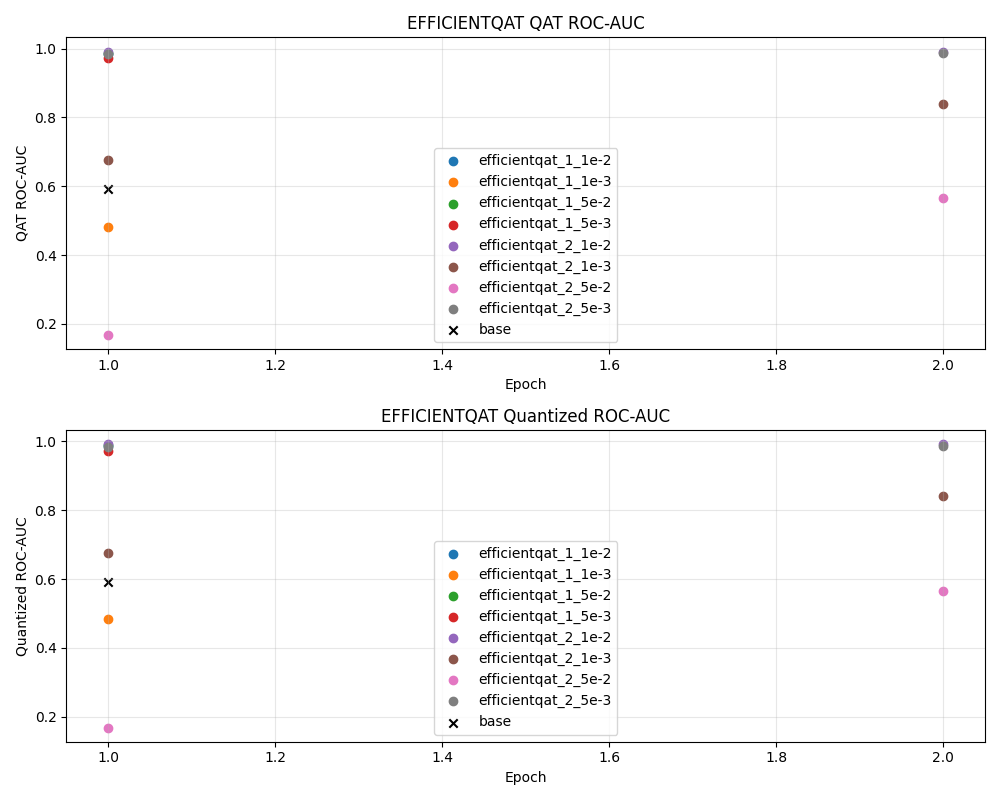
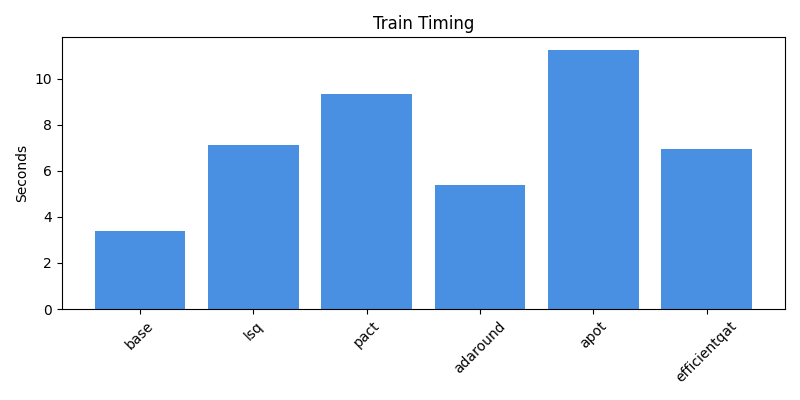
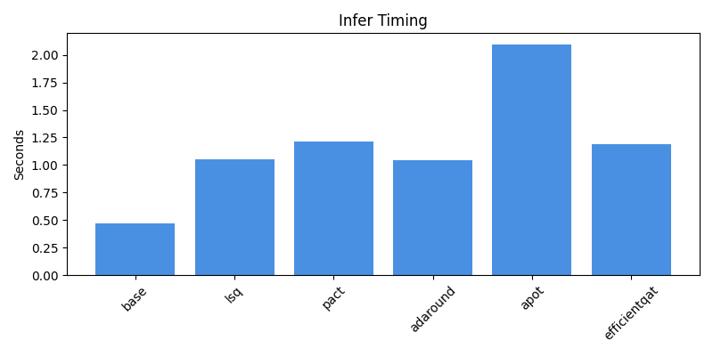

Скрипт для воспроизведения результатов:
```bash
docker build -t eff-lstm .
docker run -v "$(pwd)/artifacts_docker:/app/artifacts" -v "$(pwd)/plots_docker:/app/plots" eff-lstm
```

LSTM

Датасет:
* SMS Spam Collection Dataset
* Бинарная классификация
* 5500 семплов
* Средняя длина текста в семпле - 100 символов

Модель:
* Однонаправленная LSTM
* 2 слоя
* Размерности слоя эмбеддингов и скрытый слой 96
* Размер словаря 3500 токенов

PACT:



LSQ:


APoT:



AdaRound:



EfficientQAT:



Overall:




Выводы:
* Квантизация занимает много времени замедляя train и inference
* int8 умножения в torch написаны не так эффективно как fp32
* Для LSQ легче найти нужный конфиг не приводящий к ухудшению метрик
